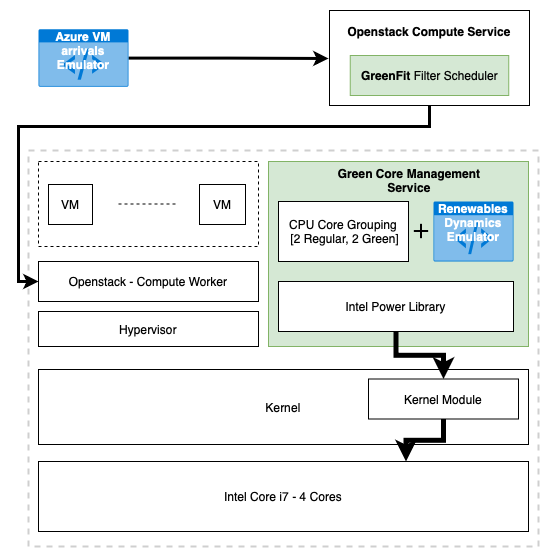

# openstack-gc

Practical implementation of VM packing with Green Cores via Openstack.

## System architecture

- #### VM Allocator
  - A standard OpenStack deployment with DevStack
- #### VM trace
  - A workload generator (bash script + cron job -> calls Openstack APIs to create a VM request) to emulate a VM arrival trace
- #### Green Cores
  1. **Renewable Dynamics** 
     - Emulate ELIA traces
  2. **Controller**
     - A Go microservice that utilizes Intel power libraries to control CPU core C-states
     - As instructed by Renewable Dynamics, Core sleep states are managed and Openstack is alerted.

