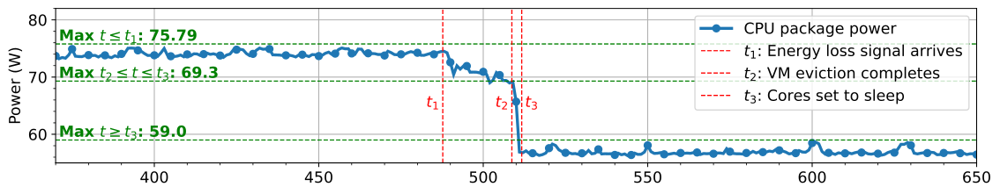
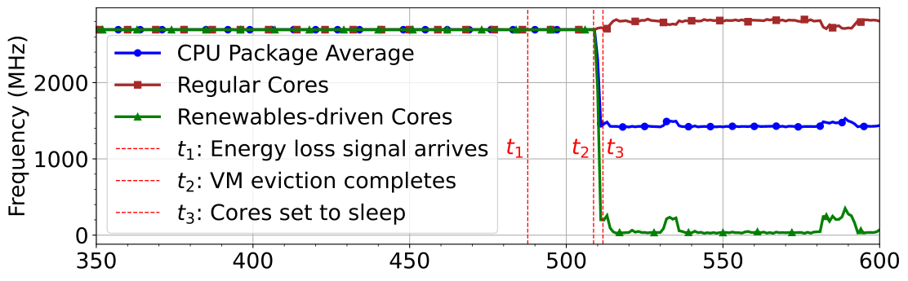
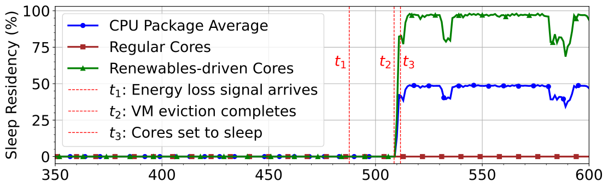
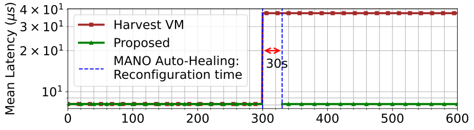

## OpenStack-GC: A Framework for Carbon-aware Real-Time Workload Management in Clouds using Renewables-driven Cores

This repository hosts the official prototype implementation of our ongoing research project aimed at harnessing renewable energy in cloud platforms for real-time workloads.

### Introduction

This work identifies a key challenge in integrating renewable energy in cloud platforms for real-time workloads. Common renewable energy sources in data centers, such as solar and wind, are intermittent. Integrating an intermittent power source requires servers in data centers to dynamically match its load (in return, its server power draw) with the available energy source capacity. The existing load matching approach for energy intermittency exploits workload temporal flexibility, such as executing workloads with reduced resources under flexible completion deadlines. However, real-time workloads denote well-defined time boundaries, which do not permit such flexibility. Instead, they execute with consistent allocation of compute, such as workloads pinned to cores with static high-performance power profiles, to meet response time boundaries. 

To this end, we propose a framework to utilize renewable energy in cloud platforms for real-time workloads. The data center uses a power delivery with grid and renewable power sources. Then, we provide each server with dedicated power capacities from the grid and renewable energy. We drive a subset of CPU cores to match the dynamics of the renewable energy availability. If the energy supply increases, we linearly switch a number of cores in the subgroup to the high-performance power profile required by real-time workloads and similarly switch to a low power profile as the energy supply decreases. Our proposed framework then employs a two-fold solution to utilize this infrastructure. Firstly, it pins workload VMs to cores in the high-performance power profile and evicts VMs if cores are insufficient to do so due to energy supply variations. Evictions are criticality-aware. Secondly, it employs a data center-wide packing algorithm to reduce the number of VM evictions while optimizing the utilization of renewable energy supply capacity.

Since our framework pins workloads to high-performance power profile cores, it preserves time boundary guarantees. In doing so, it uses criticality-aware VM evictions as a trade-off. Fault tolerance of real-time workloads over insufficient CPU cores commonly uses the same approach; thus, our framework exploits the same. 

This repository contains the implementation of a prototype of our framework in OpenStack by extending the devstack 2023.2 stable release. Below is its architecture.


To manipulate CPU power profiles, we leverage Intel's Power Optimization Library. We wrap it in a microservice and connect it with our OpenStack deployment. The code for this microservice is at [https://github.com/tharindu-b-hewage/core-power-mgt.git](https://github.com/tharindu-b-hewage/core-power-mgt.git).

### Results

Server-level power metrics of the CPU show that our framework guarantees a constant power profile for VMs when matching the server load for energy supply.





It significantly outperforms existing workload temporal flexibility-based solutions regarding the real-time latency of VMs.



Experiments use a prototype OpenStack-gc cloud with HPE ProLiant DL380 Gen10 servers.

Evaluation of the packing algorithm requires experiments at the scale of a production data center, which is part of our future work. Currently, we use trace-driven simulations for that. In this repository, we provide the implementation of the packing algorithm as a VM scheduling algorithm.

### Repository structure

- ./experiments: Server level evaluation experiments
- ./extensions:
    - [Patch for OpenStack Modifications](extensions/gc_nova_stable-2023.2.patch): Apply required changes in OpenStack, including implementation of the proposed packing algorithm.
    - ./green-cores-controller: Implementation of the controller component.
- ./figs: Figures used.

### Pre-requisites

At least two machines will run the control plane, and the other will run the computing.

For compute nodes,

- Linux-based OS
- Intel CPU with support for sleep states and dynamic frequency scaling features
- At least 2 CPU cores
- CPU hyper-threading disabled

Deployment should be done in a clean environment to avoid deployment issues.
Compute nodes should be bare-metal, as the power controller module needs to control the per-core power profile.

### Deployment guide

First, decide on an IP plan. We use

```bash
HOST_IP=100.64.42.XX
FIXED_RANGE=10.4.128.0/20
FLOATING_RANGE=100.64.42.128/25
```

Host IPs are set from 100.64.42.11 to .99.

The following configs are common for both the Control node and compute nodes. So, do that in all nodes first.

1. Run the following to create a new user `stack`.
 ```bash
    sudo useradd -s /bin/bash -d /opt/stack -m stack
    sudo chmod +x /opt/stack
    echo "stack ALL=(ALL) NOPASSWD: ALL" | sudo tee /etc/sudoers.d/stack
 ```
2. Login as the `stack` user.
 ```bash
    sudo -u stack -i
 ```
3. Clone devstack `https://github.com/openstack/devstack/tree/stable/2023.2`. Make sure to checkout to `stable/2023.2`
 branch.
 ```bash
   git clone https://github.com/openstack/devstack
   cd devstack
   git checkout stable/2023.2
 ```
4. Create a file name 'local.conf'. Refer to the section below, which contains configurations for control and compute nodes.
 Set it according to the node type.
5. Devstack downloads Nova code and then uses that during the stack.sh script runtime. We need to modify its code before. So we first do a dry run (./stack.sh -> unstack.sh). This will have files downloaded locally. We then apply
 the
 patch and run stack.sh with the necessary configs. For now, run `./stack.sh`; once completed, run `./unstack.sh`.
6. Go to OpenStack sources
 ```bash 
   cd /opt/stack/nova
 ```
7. Apply the feature patch. Make sure to replace `{GC_EMULATION_SERVICE_HOST}` and `{GC_EMULATION_SERVICE_PORT}`
 parameters in the patch file.
 ```bash
   git apply gc_nova_stable-2023.2.patch
 ```

Note: If the default location of OpenStack is going to be changed, the following configs need to be added to the `local.conf`
of
both control and compute nodes.
(default location is `/opt/stack`). Say we change from `/opt/stack` to `/data/OpenStack/opt/stack3`, then

```bash
DEST=/data/OpenStack/opt/stack3
DATA_DIR=$DEST/data
SUBUNIT_OUTPUT=$DEST/dev stack.subunit
```

Furthermore, the below change is needed in the 'stack.sh' file. From,

```bash
if [[ "$GLOBAL_VENV" == "True" ]] ; then
    # TODO(frickler): find a better solution for this
    sudo ln -sf /opt/stack/data/venv/bin/cinder-manage /usr/local/bin
    sudo ln -sf /opt/stack/data/venv/bin/cinder-stool /usr/local/bin
    sudo ln -sf /opt/stack/data/venv/bin/glance /usr/local/bin
    sudo ln -sf /opt/stack/data/venv/bin/nova-manage /usr/local/bin
    sudo ln -sf /opt/stack/data/venv/bin/OpenStack /usr/local/bin
    sudo ln -sf /opt/stack/data/venv/bin/privsep-helper /usr/local/bin
    sudo ln -sf /opt/stack/data/venv/bin/rally /usr/local/bin
    sudo ln -sf /opt/stack/data/venv/bin/tox /usr/local/bin

    setup_devstack_virtualenv
fi
```

to,

```bash
if [[ "$GLOBAL_VENV" == "True" ]] ; then
    # TODO(frickler): find a better solution for this
    sudo ln -sf /data/OpenStack/opt/stack3/data/venv/bin/cinder-manage /usr/local/bin
    sudo ln -sf /data/OpenStack/opt/stack3/data/venv/bin/cinder-stool /usr/local/bin
    sudo ln -sf /data/OpenStack/opt/stack3/data/venv/bin/glance /usr/local/bin
    sudo ln -sf /data/OpenStack/opt/stack3/data/venv/bin/nova-manage /usr/local/bin
    sudo ln -sf /data/OpenStack/opt/stack3/data/venv/bin/OpenStack /usr/local/bin
    sudo ln -sf /data/OpenStack/opt/stack3/data/venv/bin/privsep-helper /usr/local/bin
    sudo ln -sf /data/OpenStack/opt/stack3/data/venv/bin/rally /usr/local/bin
    sudo ln -sf /data/OpenStack/opt/stack3/data/venv/bin/tox /usr/local/bin

    setup_devstack_virtualenv
fi
```

Furthermore, the horizon service may fail during the stack.sh execution due to a key permission error. If the
changed location is on the NTFS drive where Ubuntu cannot change permission once mounted; the easiest hack is to edit the
corresponding python file is shown in the error log and ignores key permission verification logic.

#### Control Node

1. `local.conf`: Make sure to set the host IP to match with the node.
 ```bash
   [[local|localrc]]
   ADMIN_PASSWORD=secret
   DATABASE_PASSWORD=$ADMIN_PASSWORD
   RABBIT_PASSWORD=$ADMIN_PASSWORD
   SERVICE_PASSWORD=$ADMIN_PASSWORD
   HOST_IP=100.64.42.XX
   FIXED_RANGE=10.4.128.0/20
   FLOATING_RANGE=100.64.42.128/25
   
   [[post-config|$NOVA_CONF]]
   [DEFAULT]
   cpu_allocation_ratio=1.0
   [compute]
   cpu_sleep_info_endpoint=http://<controller-node-ip>:<emulation-service-port>/gc/is-asleep
   cpu_stable_set=<core ids of stable cores. ex: 0-4>
   cpu_dynamic_set=<core ids of dynamic cores. ex: 5-7>
   [libvirt]
   cpu_power_management=False
 ```
    - `cpu_allocation_ratio=1.0` avoid over-commiting CPU resources.
    - `cpu_sleep_info_endpoint` tells the vanilla OpenStack about whether renewables-driven cores are sleeping due to lack of
 Renewables. For now, replace controller node IP and set the port as `3000`, or anything you like. Later, we will
 deploy an emulation service for the state of Renewables.
    - `cpu_stable_set` and `cpu_dynamic_set` set the priority-ordered core pinning.
    - `cpu_power_management` is set to `False` to prevent the platform from controlling core power since we explicitly control it.
2. We then deploy a Golang emulation service (i.e., Green Cores Controller) to manage Renewables capacity changes and track and provide Green
 cores usages in compute nodes.
    - Build the service binary by navigating into [green-cores-controller](extensions%2Fgreen-cores-controller) and executing
 [build-for-linux-amd64.sh](extensions%2Fgreen-cores-controller%2Fbuild-for-Linux-amd64.sh); `sh build-for-Linux-amd64.sh`
    - Create a new folder in the control node and copy the binary.
    - Create a config file named `conf.yaml`. For all compute nodes, add an entry. This information
 are used to unpin cores from VMs during force evictions from renewables-driven cores. core IDs should map with the
 libvirt mapping at the node. That being said, throughout this deployment, following a convention of 0-indexed core
 id list with left-most IDs being stable and right-most being green for each node should work with all our
 configurations.
 ```yaml
   compute-hosts:
     - ip: <compute-node-1-ip>
         user: stack
         dynamic-core-ids: [3]
         stable-core-ids: [0,1,2]
     - ip: <compute-node-2-ip>
         user: stack
         dynamic-core-ids: [3]
         stable-core-ids: [0,1,2]
 ```
    - Emulation service needs to access all compute nodes via SSH. Therefore, copy the controller node's public key to all
 compute nodes, and test for SSH connectivity for them all via `ssh stack@<ip>` for passwordless access.
    - Upload all supporting scripts ([scripts](extensions%2Fgc-emulator-service%2Fscripts)) to this same folder
 (with emulation service). Run `chmod +x *.sh` to make them runnable.
    - Install JSON parser for virsh. - Install virsh JSON parser
        - Run `go install github.com/a-h/virshjson/cmd/virsh-json@latest`
        - Make sure `virsh-json` is detected and identified as a command.
    - Run `./gc-emulator-service conf.yaml` to start the service (consider creating a
 screen `screen -S gc-emulation-scr` -> run and detach, if you wish to run as a background process - so chances for
 os to terminate will be limited). Also, once devstack is launched, download and source openrc.sh file for the
 admin project, stop and rerun this service before testing core sleep operation as it needs to talk to devstack
 for VM evictions.
3. Start the OpenStack deployment by running `./stack.sh`.
4. To enforce the Green core packing algorithm, open `/etc/nova/nova.conf` and make sure `weight_classes` is set just to
 CPUWeighter.
 ```bash
   [filter_scheduler]
   ...
   weight_classes = nova.scheduler.weights.cpu.CPUWeigher
 ```
 Thus, our custom weighter solely performs machine ordering. Our custom filter has already been applied to the default settings.
 Afterwards, restart the nova services. `sudo systemctl restart devstack@n*`

#### Each compute node

1. `local.conf`: Set the placeholder values and core IDs for stable+dynamic sets.
 ```bash
   [[local|localrc]]
   HOST_IP=<node-ip>
   FIXED_RANGE=10.4.128.0/20
   FLOATING_RANGE=100.64.42.128/25
   LOGFILE=/opt/stack/logs/stack.sh.log
   ADMIN_PASSWORD=secret
   DATABASE_PASSWORD=secret
   RABBIT_PASSWORD=secret
   SERVICE_PASSWORD=secret
   DATABASE_TYPE=mysql
   SERVICE_HOST=<control plane node ip>
   MYSQL_HOST=$SERVICE_HOST
   RABBIT_HOST=$SERVICE_HOST
   GLANCE_HOSTPORT=$SERVICE_HOST:9292
   ENABLED_SERVICES=n-CPU,c-vol,placement-client,ovn-controller,ovs-vswitchd,ovsdb-server,q-ovn-metadata-agent
   NOVA_VNC_ENABLED=True
   NOVNCPROXY_URL="http://$SERVICE_HOST:6080/vnc_lite.html"
   VNCSERVER_LISTEN=$HOST_IP
   VNCSERVER_PROXYCLIENT_ADDRESS=$VNCSERVER_LISTEN
   [[post-config|$NOVA_CONF]]
   [DEFAULT]
   cpu_allocation_ratio=1.0
   [compute]
   # Set stable and dynamic core IDs
   cpu_stable_set=0-11
   cpu_dynamic_set=12-15
   cpu_sleep_info_endpoint=http://<controller node ip>:<emulation service port>/gc/is-asleep
   [libvirt]
   cpu_power_management=False
 ```
2. Deploy Green Cores mgt daemon (i.e. Core Sleep/Wake daemon).
    - Get the core-power-mgt release from https://github.com/tharindu-b-hewage/core-power-mgt/releases/tag/v2.2.0-alpha.
 Download the binary.
    - Copy the binary to a folder.
    - Copy all supporting scripts [scripts](extensions%2Fgc-emulator-service%2Fscripts) and make them
 runnable `chmod +x *.sh`.
    - Install `virsh-json` via go and copy that binary to the same folder.
    - Create a `conf.yaml` file with the following content.
 ```yaml
   host:
       name: 100.XX.42.15
       port: 3000
       is-emulate: false
   topology:
       stable-core-count: 12
       dynamic-core-count: 4
   power-profile:
       sleep-idle-state: C3_ACPI
       sleep-frq: 400
       perf-idle-state: POLL
       perf-frq: 2600
 ```
    - Then run `./gc-controller conf.yaml` to start the service
 (consider creating a screen `screen -S gc-emulation-scr` -> run and detach if you wish to run as a background
 process - so chances for os to terminate will be limited).
    - Start compute services via `./stack.sh`.
3. Upon all workers are deployed, run `nova-manage cell_v2 discover_hosts --verbose` to discover all nodes at the
 control node.

### Verification

1. Deployed services can be monitored by following steps from https://docs.openstack.org/devstack/2023.2/systemd.html
2. Now, we have a working Openstack-GC deployment. Let's create a VM. First, let's create a flavour for pinned cores. Log
 into the dashboard and select the
 flavour `m1.nano`. Add an attribute `hw:cpu_policy` with the value `dedicated`.
2. In the dashboard, inspect compute hosts. We should see all compute nodes.
3. In the dashboard, upgrade quota limits. Calculate the total number of cores and set the limit to that number. (admin->
 system->default). Also, the VM flavour should use CPU pinning. So update its metadata of CPU pinning to `dedicated`.
4. Now, create a VM with the flavour `m1.nano`. This will be pinned to the stable
 cores. [create-vm.sh](vm-trace%2Faz-trace-gen%2Fsrc%2Fmain%2Fresources%2Fos-client%2Fcreate-vm.sh)
 will do this, but download `admin-openrc.sh` from the dashboard under `API Access` and source it in the
 terminal. Since the emulation service uses this file to
 authenticate with OpenStack APIs, stop and restart the emulation service once the file is sourced. Also, find the
 public network's ID from the dashboard and update the `create-vm.sh` script.
5. Run `./create-vm.sh` to create a VM. Verify that the VM is made in the dashboard.
6. Initially, keep creating VMs to consume all cores in the mini-cluster.
7. Now switch the renewables-driven cores to sleep through emulation API. This should force delete all VMs occupied by renewables-driven cores.
 Also, if you observe core power status via `turbostat`, you can see that power profiles are changed to put Green
 cores into sleep.
 ```bash
   curl --location --request POST 'http://<control-node-ip>:<emulation-service-port>/gc/dev/switch'
 ```
8. Ta-da! You have a working Openstack-GC deployment. Try to launch an instance with the demo project and create and assign
 a floating IP to it. Get the ID of the default
 security group and run the following commands to allow ICMP and SSH traffic.
 ```
 OpenStack security group rule create --proto icmp --DST-port 0 <default sec. group id>
 OpenStack security group rule create --proto tcp --dst-port 22 <default sec. group id>
 ```
 After this, you can SSH the VM using the floating IP and ping it.

### Limitations

Openstack-GC is not tested for production.

Prototype implementation evaluates server-level aspects of our framework. Currently, it does not conduct criticality-aware evictions and can only switch between two states of renewable energy capacity (100\% and 0\%). Support for both will be available in future work.