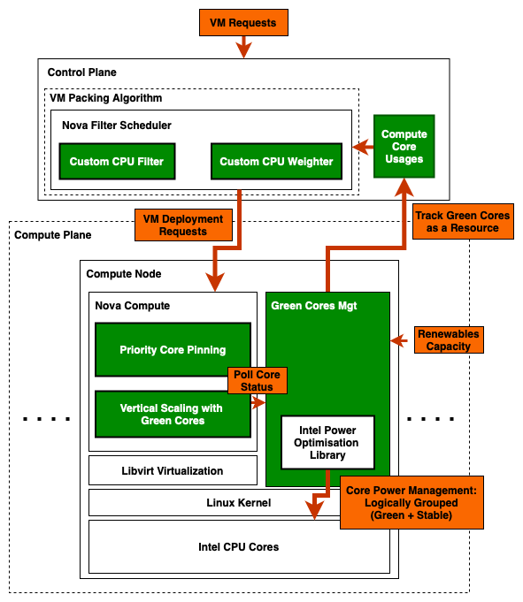

## Openstack-GC

Openstack-GC is a framework to harness intermittent Renewable energy for real-time VMs in cloud datacenters, designed to
be used with commodity hardware.

This project demonstrates a working experimental Openstack-GC private cloud. It builds on top of the stable
openstack 2023.2 via a multi-node devstack deployment.



### Requirements

At least two machines, one will run the control plane, and other runs compute. 

For compute nodes,
- Linux-based OS
- Intel CPU with idle-states, and dynamic frequency scaling feature support
- At least 2 CPU cores
- CPU hyper-threading disabled

Compute nodes should be a clean environment to avoid deployment issues.

Compute nodes should directly run on bare-metal, as power controller module needs to control Core power profile.

### Scenario

Openstack-GC reacts to the Renewables capacity by putting cores to sleep/wake.
In this deployment, we assume that Renewables only change between two states, such that Green cores are either all
asleep or all awake. Since this can be easily extended for multi-level scenario, we will not test it here.

### Deployment Guide

Decide an IP plan. We use
```bash
HOST_IP=100.64.42.XX
FIXED_RANGE=10.4.128.0/20
FLOATING_RANGE=100.64.42.128/25
```
Host IPs are set from 100.64.42.11 to .99.

Following are common for both Control node and compute nodes. So do that in all nodes first.

1. Run following to create a new user `stack`.
    ```bash
    sudo useradd -s /bin/bash -d /opt/stack -m stack
    sudo chmod +x /opt/stack
    echo "stack ALL=(ALL) NOPASSWD: ALL" | sudo tee /etc/sudoers.d/stack
    ```
2. Login as the `stack` user.
    ```bash
    sudo -u stack -i
    ```
3. Clone devstack `https://github.com/openstack/devstack/tree/stable/2023.2`. Make sure to checkout to `stable/2023.2` branch.
    ```bash
   git clone https://github.com/openstack/devstack
   cd devstack
   git checkout stable/2023.2
    ```
4. Create a file name 'local.conf'. Refer to section below, as it contains configurations for control and compute nodes.
Set it according to the node type.
5. Devstack downloads nova code and then use that during the stack.sh script runtime. We need to modify its code before. 
that. So we first do a dry run (./stack.sh -> unstack.sh). This will have files downloaded to local. We then apply the
patch and run stack.sh with necessary configs. For now, run `./stack.sh`, and once completed, run `./unstack.sh`.
6. Go to openstack sources
   ```bash 
   cd /opt/stack/nova
   ```
7. Apply the feature patch. Make sure to replace `{GC_EMULATION_SERVICE_HOST}` and `{GC_EMULATION_SERVICE_PORT}` 
parameters in the patch file. 
   ```bash
   git apply gc_nova_stable-2023.2.patch
   ```

Note: If default location of openstack is going to be changed, following configs needs to be added to the `local.conf` of
both control and compute nodes.
(default location is `/opt/stack`). Say we change from `/opt/stack` to `/data/openstack/opt/stack3`, then
```bash
DEST=/data/openstack/opt/stack3
DATA_DIR=$DEST/data
SUBUNIT_OUTPUT=$DEST/devstack.subunit
```
Furthermore, below change is needed in the 'stack.sh' file. From,
```bash
if [[ "$GLOBAL_VENV" == "True" ]] ; then
    # TODO(frickler): find a better solution for this
    sudo ln -sf /opt/stack/data/venv/bin/cinder-manage /usr/local/bin
    sudo ln -sf /opt/stack/data/venv/bin/cinder-rtstool /usr/local/bin
    sudo ln -sf /opt/stack/data/venv/bin/glance /usr/local/bin
    sudo ln -sf /opt/stack/data/venv/bin/nova-manage /usr/local/bin
    sudo ln -sf /opt/stack/data/venv/bin/openstack /usr/local/bin
    sudo ln -sf /opt/stack/data/venv/bin/privsep-helper /usr/local/bin
    sudo ln -sf /opt/stack/data/venv/bin/rally /usr/local/bin
    sudo ln -sf /opt/stack/data/venv/bin/tox /usr/local/bin

    setup_devstack_virtualenv
fi
```
to,
```bash
if [[ "$GLOBAL_VENV" == "True" ]] ; then
    # TODO(frickler): find a better solution for this
    sudo ln -sf /data/openstack/opt/stack3/data/venv/bin/cinder-manage /usr/local/bin
    sudo ln -sf /data/openstack/opt/stack3/data/venv/bin/cinder-rtstool /usr/local/bin
    sudo ln -sf /data/openstack/opt/stack3/data/venv/bin/glance /usr/local/bin
    sudo ln -sf /data/openstack/opt/stack3/data/venv/bin/nova-manage /usr/local/bin
    sudo ln -sf /data/openstack/opt/stack3/data/venv/bin/openstack /usr/local/bin
    sudo ln -sf /data/openstack/opt/stack3/data/venv/bin/privsep-helper /usr/local/bin
    sudo ln -sf /data/openstack/opt/stack3/data/venv/bin/rally /usr/local/bin
    sudo ln -sf /data/openstack/opt/stack3/data/venv/bin/tox /usr/local/bin

    setup_devstack_virtualenv
fi
```
Furthermore, it is possible that horizon service fails during stack.sh execution due to key permission error. If the 
changed location is on ntfs drive where ubuntu cannot change permission once mounted, then easiest hack is to edit the
corresponding python file shown in the error log, and ignore key permission verification logic.
   
#### Control Node

1. `local.conf`: Make sure to set the host IP to match with the node.
   ```bash
   [[local|localrc]]
   ADMIN_PASSWORD=secret
   DATABASE_PASSWORD=$ADMIN_PASSWORD
   RABBIT_PASSWORD=$ADMIN_PASSWORD
   SERVICE_PASSWORD=$ADMIN_PASSWORD
   HOST_IP=100.64.42.XX
   FIXED_RANGE=10.4.128.0/20
   FLOATING_RANGE=100.64.42.128/25
   
   [[post-config|$NOVA_CONF]]
   [DEFAULT]
   cpu_allocation_ratio=1.0
   [compute]
   cpu_sleep_info_endpoint=http://<controller-node-ip>:<emulation-service-port>/gc/is-asleep
   cpu_stable_set=<core ids of stable cores. ex: 0-4>
   cpu_dynamic_set=<core ids of dynamic cores. ex: 5-7>
   [libvirt]
   cpu_power_management=False
   ```
   - `cpu_allocation_ratio=1.0` avoid over-commiting CPU resources.
   - `cpu_sleep_info_endpoint` tells the vanilla Openstack about whether Green cores are sleeping due to lack of 
   Renewables. For now, replace controller node IP and set the port as `3000`, or anything you like. Later we will 
   deploy an emulation service for Renewables state.
   - `cpu_stable_set` and `cpu_dynamic_set` are used to set the priority-ordered core pinning.
   - `cpu_power_management` is set to `False` to avoid platform controlling Core power, since we explicitly control it.
2. We then deploy a Golang emulation service to Manage Renewables capacity changes, as well as track and provide Green
cores usages in compute nodes.
   - Build the service binary by navigating into [gc-emulator-service](extensions%2Fgc-emulator-service), and executing 
   [build-for-linux-amd64.sh](extensions%2Fgc-emulator-service%2Fbuild-for-linux-amd64.sh); `sh build-for-linux-amd64.sh`
   - Create a new folder in the control node and copy the binary to it.
   - Create a config file named `conf.yaml`. For all compute nodes, add an entry. These information
   are used to unpinning of cores from VMs during force evictions from Green cores. core ids should map with the
   libvirt mapping at the node. That being said, throughout this deployment, following a convention of 0-indexed core 
   id list with left-most ids being stable and right-most being green for each node, should work with all our configurations.
   ```yaml
   compute-hosts:
       - ip: <compute-node-1-ip>
         user: stack
         dynamic-core-ids: [3]
         stable-core-ids: [0,1,2]
       - ip: <compute-node-2-ip>
         user: stack
         dynamic-core-ids: [3]
         stable-core-ids: [0,1,2]
   ```
   - Emulation service needs to access all compute nodes via SSH. Therefore, copy controller node's public key to all 
   compute nodes, and test for ssh connectivity for them all via `ssh stack@<ip>` for passwordless access.
   - Upload all supporting scripts ([scripts](extensions%2Fgc-emulator-service%2Fscripts)) to this same folder 
   (with emulation service). Run `chmod +x *.sh` to make them runnable.
   - Install json parser for virsh. - Install virsh json parser
     - Run `go install github.com/a-h/virshjson/cmd/virsh-json@latest`
     - Make sure `virsh-json` is detected and identified as a command.
   - Run `./gc-emulator-service conf.yaml` to start the service (consider creating a screen `screen -S gc-emulation-scr` -> run and detach, if you wish to run as a background process - so chances for os to terminate will be limited). Also, once devstack is launched, download and source openrc.sh file for the admin project, stop and rerun this service, before testing core sleep operation as it needs to talk to devstack for VM evictions.
3. Start the Openstack deployment by running `./stack.sh`.
4. To enforce Green core packing algorithm, open `/etc/nova/nova.conf` and make sure `weight_classes` is set just to CPUWeighter.
   ```bash
   [filter_scheduler]
   ...
   weight_classes = nova.scheduler.weights.cpu.CPUWeigher
   ```
   Thus, our custom weighter solely perform machine ordering. Our custom filter is already applied via default settings.
   Afterwards, restart the nova services. `sudo systemctl restart devstack@n*`

#### Each compute node
1. `local.conf`: Make sure to set the placeholder values and core ids for stable+dynamic sets.
   ```bash
   [[local|localrc]]
   HOST_IP=<node-ip>
   FIXED_RANGE=10.4.128.0/20
   FLOATING_RANGE=100.64.42.128/25
   LOGFILE=/opt/stack/logs/stack.sh.log
   ADMIN_PASSWORD=secret
   DATABASE_PASSWORD=secret
   RABBIT_PASSWORD=secret
   SERVICE_PASSWORD=secret
   DATABASE_TYPE=mysql
   SERVICE_HOST=<control plane node ip>
   MYSQL_HOST=$SERVICE_HOST
   RABBIT_HOST=$SERVICE_HOST
   GLANCE_HOSTPORT=$SERVICE_HOST:9292
   ENABLED_SERVICES=n-cpu,c-vol,placement-client,ovn-controller,ovs-vswitchd,ovsdb-server,q-ovn-metadata-agent
   NOVA_VNC_ENABLED=True
   NOVNCPROXY_URL="http://$SERVICE_HOST:6080/vnc_lite.html"
   VNCSERVER_LISTEN=$HOST_IP
   VNCSERVER_PROXYCLIENT_ADDRESS=$VNCSERVER_LISTEN
   [[post-config|$NOVA_CONF]]
   [DEFAULT]
   cpu_allocation_ratio=1.0
   [compute]
   # Set stable and dynamic core ids
   cpu_stable_set=0-11
   cpu_dynamic_set=12-15
   cpu_sleep_info_endpoint=http://<controller node ip>:<emulation service port>/gc/is-asleep
   [libvirt]
   cpu_power_management=False
   ```
2. Deploy Green Cores mgt daemon.
   - Get the core-power-mgt release from https://github.com/crunchycookie/core-power-mgt/releases/tag/v2.2.0-alpha. 
   Download the binary.
   - Copy the binary to a folder. 
   - Copy all supporting scripts [scripts](extensions%2Fgc-emulator-service%2Fscripts) and make them runnable `chmod +x *.sh`.
   - Also, install `virsh-json` via go and copy that binary to the same folder. 
   - Create a `conf.yaml` file with the following content.
   ```yaml
   host:
       name: 100.XX.42.15
       port: 3000
       is-emulate: false
   topology:
       stable-core-count: 12
       dynamic-core-count: 4
   power-profile:
       sleep-idle-state: C3_ACPI
       sleep-frq: 400
       perf-idle-state: POLL
       perf-frq: 2600
   ```
   - Then run `./gc-controller conf.yaml` to start the service 
   (consider creating a screen `screen -S gc-emulation-scr` -> run and detach, if you wish to run as a background
   process - so chances for os to terminate will be limited).
   - Start compute services via `./stack.sh`.
3. Upon all workers are deployed, run `nova-manage cell_v2 discover_hosts --verbose` to discover all nodes at the 
control node.

### Verification

1. Now, we have a working Openstack-GC deployment. Let's create a VM. First, lets create a flavor for pinned cores. Log into dashboard and select the
   flavour `m1.nano`. Add and attribute `hw:cpu_policy` with value `dedicated`.
2. In the dashboard, inspect compute hosts. We should see all compute nodes.
3. In the dashboard, upgrade quota limits. Calculate total number of cores, and set the limit to that number. (admin->system->default). Also, the vm flavor should use cpu pinning. So update its metadata of cpu pinning to `dedicated`.
4. Now, create a VM with the flavor `m1.nano`. This will be pinned to the stable cores. [create-vm.sh](vm-trace%2Faz-trace-gen%2Fsrc%2Fmain%2Fresources%2Fos-client%2Fcreate-vm.sh)
   will do this, but make sure to download `admin-openrc.sh` from dashboard under `API Access`, and source it in the terminal. Since emulation service uses this file to
   authenticate with Openstack APIs, stop and restart the emulation service once the file is sourced. Also, find the public network's ID from dashboard and update the `create-vm.sh` script.
5. Run `./create-vm.sh` to create a VM. Verify that the VM is created in the dashboard.
6. Initially, keep creating VMs to consume all cores in the mini-cluster.
7. Now switch the green cores to sleep through emulation API. This should force delete all VMs occupied green cores.
Also, if you observe core power status via `turbostat`, you can see that power profiles are changed to put Green cores into sleep.
   ```bash
   curl --location --request POST 'http://<control-node-ip>:<emulation-service-port>/gc/dev/switch'
   ```
8. Ta da! You have a working Openstack-GC cluster with Green Cores. Try experimenting with different scheduling 
approaches so that unstable Green Cores can be effectively utilized.
9. PS: Launch an instance with the demo project, create and assign a floating IP to that. Get the ID of the default 
security group and run the following commands to allow ICMP and SSH traffic.
   ```
   openstack security group rule create --proto icmp --dst-port 0 <default sec. group id>
   openstack security group rule create --proto tcp --dst-port 22 <default sec. group id>
   ```
   After this, you can SSH into the VM using the floating IP, and also ping.
### Experiments

#### Packing experiments

Packing experiments are outlined in [packing-experiment](experiments%2Fpacking-experiment).

Packing results with various evictability probabilities in the incoming VM trace. Packing algorithm prioritize various 
factors for better Renewable utilization and better packing metrics.

Evict: 0.0           |        Evict: 1.0         |  Evict: 0.1179 
:-------------------------:|:-------------------------:|:-------------------------:
 | |

#### Power experiments

##### Workload reports - RTEval

Maintain service quality.

vm-1          |                                           vm-2                                           |  vm-3
:-------------------------:|:----------------------------------------------------------------------------------------:|:-------------------------:
 |  | 

##### Package Power

Power management to avoid power overdrawing.


##### Core Power Management

Functional behaviour of Green Cores.

Deep Sleep         | Operating Frequency
:-------------------------:|:-------------------------:
 |

##### 

### Notes

- Openstack-GC is not tested for production.
- Tip: Provide internet access to guest VM: https://rahulait.wordpress.com/2016/06/27/manually-routing-traffic-from-br-ex-to-internet-devstack/

### Limitations
In production, VMs can terminate and vacate the machine. In these cases, core pinning can become fragmented on the machine. However, power draw depends on the number of cores rather than the physical grouping of cores. Therefore, in such cases, the actual core sleep behavior should prioritize sleeping unused cores first, regardless of whether they belong to a specific core group such as green cores.

Our current implementation assumes that all VMs live indefinitely since our experiments are designed for short-term 
power management and eviction-impact analysis. Therefore, we use group-based core sleeping. Before using OpenStack-GC
for long-term experiments, the core sleep approach needs to be adjusted, along with the calculation of available/used 
green/regular cores from group-based to count-based. In doing so, one must address the process of sleeping certain 
cores, as OpenStack might have hardcoded such operations, which could lead to failures. An example would be the 0th core.

### Monitoring devstack services
https://docs.openstack.org/devstack/2023.2/systemd.html