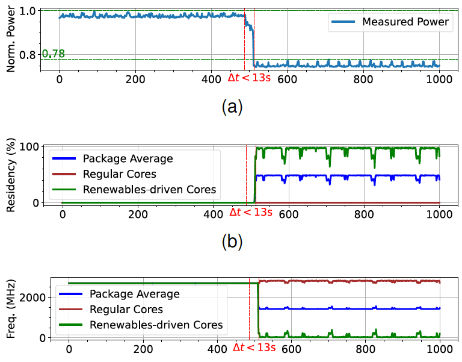

## Openstack-GC: a renewable energy harvesting framework for real-time workloads via renewables-driven cores

Openstack-GC is a framework to harvest renewable energy in data centers executing real-time workloads. Unlike
existing workload temporal flexibility-reliant renewable energy harvest solutions, it exploits
mixed-criticality in real-time systems. The implementation extends to OpenStack. First, it applies
renewables-driven cores in server CPUs using the Intel Power Optimization library. Then it conducts server-level load
matching against the availability of renewables, using criticality-aware VM evictions. At the control plane,
a custom VM scheduling algorithm reduces the possibilities of eviction incidents, while maximizing the
renewable energy utilization.

This project deploys an experimental multi-node Openstack-GC cloud. It extends the devstack 2023.2.


### Pre-requisites

At least two machines, one will run the control plane, and the other will run the computing.

For compute nodes,

- Linux-based OS
- Intel CPU with support for sleep states and dynamic frequency scaling features
- At least 2 CPU cores
- CPU hyper-threading disabled

Deployment should be done in a clean environment to avoid deployment issues.
Compute nodes should be bare-metal as the power controller module needs to control the per-core power profile.

### Deployment guide

First, decide on an IP plan. We use

```bash
HOST_IP=100.64.42.XX
FIXED_RANGE=10.4.128.0/20
FLOATING_RANGE=100.64.42.128/25
```

Host IPs are set from 100.64.42.11 to .99.

The following configs are common for both the Control node and compute nodes. So do that in all nodes first.

1. Run the following to create a new user `stack`.
    ```bash
    sudo useradd -s /bin/bash -d /opt/stack -m stack
    sudo chmod +x /opt/stack
    echo "stack ALL=(ALL) NOPASSWD: ALL" | sudo tee /etc/sudoers.d/stack
    ```
2. Login as the `stack` user.
    ```bash
    sudo -u stack -i
    ```
3. Clone devstack `https://github.com/openstack/devstack/tree/stable/2023.2`. Make sure to checkout to `stable/2023.2`
   branch.
    ```bash
   git clone https://github.com/openstack/devstack
   cd devstack
   git checkout stable/2023.2
    ```
4. Create a file name 'local.conf'. Refer to the section below, which contains configurations for control and compute nodes.
   Set it according to the node type.
5. Devstack downloads Nova code and then uses that during the stack.sh script runtime. We need to modify its code before.
   that. So we first do a dry run (./stack.sh -> unstack.sh). This will have files downloaded locally. We then apply
   the
   patch and run stack.sh with the necessary configs. For now, run `./stack.sh`, and once completed, run `./unstack.sh`.
6. Go to OpenStack sources
   ```bash 
   cd /opt/stack/nova
   ```
7. Apply the feature patch. Make sure to replace `{GC_EMULATION_SERVICE_HOST}` and `{GC_EMULATION_SERVICE_PORT}`
   parameters in the patch file.
   ```bash
   git apply gc_nova_stable-2023.2.patch
   ```

Note: If the default location of OpenStack is going to be changed, the following configs need to be added to the `local.conf`
of
both control and compute nodes.
(default location is `/opt/stack`). Say we change from `/opt/stack` to `/data/openstack/opt/stack3`, then

```bash
DEST=/data/openstack/opt/stack3
DATA_DIR=$DEST/data
SUBUNIT_OUTPUT=$DEST/devstack.subunit
```

Furthermore, the below change is needed in the 'stack.sh' file. From,

```bash
if [[ "$GLOBAL_VENV" == "True" ]] ; then
    # TODO(frickler): find a better solution for this
    sudo ln -sf /opt/stack/data/venv/bin/cinder-manage /usr/local/bin
    sudo ln -sf /opt/stack/data/venv/bin/cinder-rtstool /usr/local/bin
    sudo ln -sf /opt/stack/data/venv/bin/glance /usr/local/bin
    sudo ln -sf /opt/stack/data/venv/bin/nova-manage /usr/local/bin
    sudo ln -sf /opt/stack/data/venv/bin/openstack /usr/local/bin
    sudo ln -sf /opt/stack/data/venv/bin/privsep-helper /usr/local/bin
    sudo ln -sf /opt/stack/data/venv/bin/rally /usr/local/bin
    sudo ln -sf /opt/stack/data/venv/bin/tox /usr/local/bin

    setup_devstack_virtualenv
fi
```

to,

```bash
if [[ "$GLOBAL_VENV" == "True" ]] ; then
    # TODO(frickler): find a better solution for this
    sudo ln -sf /data/openstack/opt/stack3/data/venv/bin/cinder-manage /usr/local/bin
    sudo ln -sf /data/openstack/opt/stack3/data/venv/bin/cinder-rtstool /usr/local/bin
    sudo ln -sf /data/openstack/opt/stack3/data/venv/bin/glance /usr/local/bin
    sudo ln -sf /data/openstack/opt/stack3/data/venv/bin/nova-manage /usr/local/bin
    sudo ln -sf /data/openstack/opt/stack3/data/venv/bin/openstack /usr/local/bin
    sudo ln -sf /data/openstack/opt/stack3/data/venv/bin/privsep-helper /usr/local/bin
    sudo ln -sf /data/openstack/opt/stack3/data/venv/bin/rally /usr/local/bin
    sudo ln -sf /data/openstack/opt/stack3/data/venv/bin/tox /usr/local/bin

    setup_devstack_virtualenv
fi
```

Furthermore, the horizon service may fail during the stack.sh execution due to a key permission error. If the
changed location is on the NTFS drive where Ubuntu cannot change permission once mounted, The easiest hack is to edit the
corresponding python file is shown in the error log and ignores key permission verification logic.

#### Control Node

1. `local.conf`: Make sure to set the host IP to match with the node.
   ```bash
   [[local|localrc]]
   ADMIN_PASSWORD=secret
   DATABASE_PASSWORD=$ADMIN_PASSWORD
   RABBIT_PASSWORD=$ADMIN_PASSWORD
   SERVICE_PASSWORD=$ADMIN_PASSWORD
   HOST_IP=100.64.42.XX
   FIXED_RANGE=10.4.128.0/20
   FLOATING_RANGE=100.64.42.128/25
   
   [[post-config|$NOVA_CONF]]
   [DEFAULT]
   cpu_allocation_ratio=1.0
   [compute]
   cpu_sleep_info_endpoint=http://<controller-node-ip>:<emulation-service-port>/gc/is-asleep
   cpu_stable_set=<core ids of stable cores. ex: 0-4>
   cpu_dynamic_set=<core ids of dynamic cores. ex: 5-7>
   [libvirt]
   cpu_power_management=False
   ```
    - `cpu_allocation_ratio=1.0` avoid over-commiting CPU resources.
    - `cpu_sleep_info_endpoint` tells the vanilla Openstack about whether renewables-driven cores are sleeping due to lack of
      Renewables. For now, replace controller node IP and set the port as `3000`, or anything you like. Later we will
      deploy an emulation service for the Renewables state.
    - `cpu_stable_set` and `cpu_dynamic_set` are used to set the priority-ordered core pinning.
    - `cpu_power_management` is set to `False` to avoid the platform controlling Core power, since we explicitly control it.
2. We then deploy a Golang emulation service (i.e. Green Cores Controller) to manage Renewables capacity changes, as
   well as track and provide Green
   cores usages in compute nodes.
    - Build the service binary by navigating into [green-cores-controller](extensions%2Fgreen-cores-controller), and executing
      [build-for-linux-amd64.sh](extensions%2Fgreen-cores-controller%2Fbuild-for-linux-amd64.sh); `sh build-for-linux-amd64.sh`
    - Create a new folder in the control node and copy the binary to it.
    - Create a config file named `conf.yaml`. For all compute nodes, add an entry. This information
      are used to unpinning of cores from VMs during force evictions from renewables-driven cores. core IDs should map with the
      libvirt mapping at the node. That being said, throughout this deployment, following a convention of 0-indexed core
      id list with left-most IDs being stable and right-most being green for each node should work with all our
      configurations.
   ```yaml
   compute-hosts:
       - ip: <compute-node-1-ip>
         user: stack
         dynamic-core-ids: [3]
         stable-core-ids: [0,1,2]
       - ip: <compute-node-2-ip>
         user: stack
         dynamic-core-ids: [3]
         stable-core-ids: [0,1,2]
   ```
    - Emulation service needs to access all compute nodes via SSH. Therefore, copy the controller node's public key to all
      compute nodes, and test for SSH connectivity for them all via `ssh stack@<ip>` for passwordless access.
    - Upload all supporting scripts ([scripts](extensions%2Fgc-emulator-service%2Fscripts)) to this same folder
      (with emulation service). Run `chmod +x *.sh` to make them runnable.
    - Install JSON parser for virsh. - Install virsh JSON parser
        - Run `go install github.com/a-h/virshjson/cmd/virsh-json@latest`
        - Make sure `virsh-json` is detected and identified as a command.
    - Run `./gc-emulator-service conf.yaml` to start the service (consider creating a
      screen `screen -S gc-emulation-scr` -> run and detach, if you wish to run as a background process - so chances for
      os to terminate will be limited). Also, once devstack is launched, download and source openrc.sh file for the
      admin project, stop and rerun this service, before testing core sleep operation as it needs to talk to devstack
      for VM evictions.
3. Start the OpenStack deployment by running `./stack.sh`.
4. To enforce the Green core packing algorithm, open `/etc/nova/nova.conf` and make sure `weight_classes` is set just to
   CPUWeighter.
   ```bash
   [filter_scheduler]
   ...
   weight_classes = nova.scheduler.weights.cpu.CPUWeigher
   ```
   Thus, our custom weighter solely performs machine ordering. Our custom filter is already applied via default settings.
   Afterwards, restart the nova services. `sudo systemctl restart devstack@n*`

#### Each compute node

1. `local.conf`: Make sure to set the placeholder values and core IDs for stable+dynamic sets.
   ```bash
   [[local|localrc]]
   HOST_IP=<node-ip>
   FIXED_RANGE=10.4.128.0/20
   FLOATING_RANGE=100.64.42.128/25
   LOGFILE=/opt/stack/logs/stack.sh.log
   ADMIN_PASSWORD=secret
   DATABASE_PASSWORD=secret
   RABBIT_PASSWORD=secret
   SERVICE_PASSWORD=secret
   DATABASE_TYPE=mysql
   SERVICE_HOST=<control plane node ip>
   MYSQL_HOST=$SERVICE_HOST
   RABBIT_HOST=$SERVICE_HOST
   GLANCE_HOSTPORT=$SERVICE_HOST:9292
   ENABLED_SERVICES=n-cpu,c-vol,placement-client,ovn-controller,ovs-vswitchd,ovsdb-server,q-ovn-metadata-agent
   NOVA_VNC_ENABLED=True
   NOVNCPROXY_URL="http://$SERVICE_HOST:6080/vnc_lite.html"
   VNCSERVER_LISTEN=$HOST_IP
   VNCSERVER_PROXYCLIENT_ADDRESS=$VNCSERVER_LISTEN
   [[post-config|$NOVA_CONF]]
   [DEFAULT]
   cpu_allocation_ratio=1.0
   [compute]
   # Set stable and dynamic core IDs
   cpu_stable_set=0-11
   cpu_dynamic_set=12-15
   cpu_sleep_info_endpoint=http://<controller node ip>:<emulation service port>/gc/is-asleep
   [libvirt]
   cpu_power_management=False
   ```
2. Deploy Green Cores mgt daemon (i.e. Core Sleep/Wake daemon).
    - Get the core-power-mgt release from https://github.com/tharindu-b-hewage/core-power-mgt/releases/tag/v2.2.0-alpha.
      Download the binary.
    - Copy the binary to a folder.
    - Copy all supporting scripts [scripts](extensions%2Fgc-emulator-service%2Fscripts) and make them
      runnable `chmod +x *.sh`.
    - Also, install `virsh-json` via go and copy that binary to the same folder.
    - Create a `conf.yaml` file with the following content.
   ```yaml
   host:
       name: 100.XX.42.15
       port: 3000
       is-emulate: false
   topology:
       stable-core-count: 12
       dynamic-core-count: 4
   power-profile:
       sleep-idle-state: C3_ACPI
       sleep-frq: 400
       perf-idle-state: POLL
       perf-frq: 2600
   ```
    - Then run `./gc-controller conf.yaml` to start the service
      (consider creating a screen `screen -S gc-emulation-scr` -> run and detach, if you wish to run as a background
      process - so chances for os to terminate will be limited).
    - Start compute services via `./stack.sh`.
3. Upon all workers are deployed, run `nova-manage cell_v2 discover_hosts --verbose` to discover all nodes at the
   control node.

### Verification

1. Deployed services can be monitored by following steps from https://docs.openstack.org/devstack/2023.2/systemd.html
2. Now, we have a working Openstack-GC deployment. Let's create a VM. First, let's create a flavour for pinned cores. Log
   into the dashboard and select the
   flavour `m1.nano`. Add an attribute `hw:cpu_policy` with the value `dedicated`.
2. In the dashboard, inspect compute hosts. We should see all compute nodes.
3. In the dashboard, upgrade quota limits. Calculate the total number of cores, and set the limit to that number. (admin->
   system->default). Also, the VM flavour should use CPU pinning. So update its metadata of CPU pinning to `dedicated`.
4. Now, create a VM with the flavour `m1.nano`. This will be pinned to the stable
   cores. [create-vm.sh](vm-trace%2Faz-trace-gen%2Fsrc%2Fmain%2Fresources%2Fos-client%2Fcreate-vm.sh)
   will do this, but make sure to download `admin-openrc.sh` from the dashboard under `API Access`, and source it in the
   terminal. Since the emulation service uses this file to
   authenticate with OpenStack APIs, stop and restart the emulation service once the file is sourced. Also, find the
   public network's ID from the dashboard and update the `create-vm.sh` script.
5. Run `./create-vm.sh` to create a VM. Verify that the VM is created in the dashboard.
6. Initially, keep creating VMs to consume all cores in the mini-cluster.
7. Now switch the renewables-driven cores to sleep through emulation API. This should force delete all VMs occupied by renewables-driven cores.
   Also, if you observe core power status via `turbostat`, you can see that power profiles are changed to put Green
   cores into sleep.
   ```bash
   curl --location --request POST 'http://<control-node-ip>:<emulation-service-port>/gc/dev/switch'
   ```
8. Ta-da! You have a working Openstack-GC deployment. Try to launch an instance with the demo project, and create and assign
   a floating IP to that. Get the ID of the default
   security group and run the following commands to allow ICMP and SSH traffic.
   ```
   openstack security group rule create --proto icmp --dst-port 0 <default sec. group id>
   openstack security group rule create --proto tcp --dst-port 22 <default sec. group id>
   ```
   After this, you can SSH into the VM using the floating IP, and also ping.

### Experiments

The following tables outline the experimental setup. We use an HPE ProLiant server with the following configurations.

| Attribute                      | Description                  |
|--------------------------------|------------------------------|
| Server Model                   | ProLiant DL380 Gen10         |
| CPU                            | Intel(R) Xeon(R) Silver 4214 |
| Physical Cores                 | 12                           |
| Hyper-Threading                | Disabled                     |
| Renewables-driven Cores        | 6                            |
| real-time power profile (PACT) | C-state = POLL at 2699 MHz   |
| low power profile (PSLP)       | C-state = C6                 |

For the workload, we deploy VMs with the following configurations and test for the real-time performance of the VM kernel.

| Attribute          | Description                             |
|--------------------|-----------------------------------------|
| Resources          | CPU: 6 Cores, RAM: 6GB                  |
| OS                 | CentOS 7                                |
| Kernel             | Linux 3.10.0 + CERN’s Real-Time patches |
| System Load        | Load test of RTEval                     |
| Latency Monitoring | Cyclictest                              |

We conduct a load-matching experiment using the above setup. First, we provide the signal to the
deployment to wake all renewables-driven cores in the server. This emulates 100% availability of
renewable energy. Then, we signal to put all renewables-driven cores to sleep. This emulates 0% availability
of renewable energy. During the experiment, we measure CPU metrics using Intel's Running Average Power Limit (RAPL)
interface. Below are the results collected.



Results agree with the expected behaviour of core power profile transitions of
renewables-driven cores. At peak load, deployment shows a 22% power
at 100% renewables availability. It demonstrates the amount of harvested renewable energy.

Note: The custom VM scheduling algorithm needs a large-scale deployment to test its
effectiveness. Experiments at scale are a part of our next release.

### Limitations

Openstack-GC is not tested for production.

In production, VMs can terminate and vacate the machine. In these cases, core pinning can become fragmented
on the machine. i.e. subsequent cores can exhibit both pinned and unpinned states. In such cases, core sleep/wake has
more opportunity to sleep unused cores first (however in practice, OpenStack may have adverse effects on sleeping specific
cores such as the 0th one. These need to be tested first). Also, in load matching at scale, VM evictions by the 
control plane benefit from VM criticality. These works are part of the next release.

Currently, renewable capacity changes between two states, such that renewables-driven cores are either all
asleep or all awake. More granular state changes will be available in the next release.